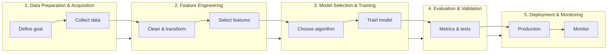

# Class 2 - Machine Learning Basics

Hands-on ML with **NumPy**, **Pandas**, and **scikit-learn**: from raw data to model-ready features. Whether you're new to Python or an experienced engineer, you'll see the same pipeline that powers production ML—data prep, feature engineering, scaling, and train/test splits—with minimal jargon and runnable notebooks.

## The ML workflow (what we cover)

Real-world ML follows a clear path. The diagram below is the same mental model used from startups to big infra; Class 2 focuses on the first two steps so your data is ready for training.



| Step | What it means | Notebook(s) in this class |
|------|----------------|---------------------------|
| **1. Data Preparation & Acquisition** | Define the goal and collect high-quality data. | Setup and small-dataset examples in both notebooks. |
| **2. Feature Engineering** | Clean, transform, and select the most relevant features for the model. | **data-preprocessing.ipynb** (core); **scaling-data.ipynb** (visualization + scaling). |
| **3. Model Selection & Training** | Choose an algorithm and train on prepared data. | Touched in Class 2 (train/test split); full modeling in later classes. |
| **4. Evaluation & Validation** | Test the model with appropriate metrics. | Later classes. |
| **5. Deployment & Monitoring** | Put the model in production and monitor it. | Later classes. |

**Start here:** Do **data-preprocessing.ipynb** first (DataFrames, missing values, encoding, scaling). Then **scaling-data.ipynb** (plots + scaling with the same dataset). Each notebook has an **Open in Colab** link so you can run everything in the browser with no local setup.

---

## Slides

- **[Machine Learning (Class 2) — PDF on GitHub](https://github.com/adzuci/ai-fundamentals/blob/main/class-2-machine-learning-basics/Machine%20Learning.pdf)** — Deck as PDF (view or download).

---

## Setup (local)

This class uses Jupyter Notebook. You only need Python and a few libraries.

### Install

```bash
pip install jupyter
```

Recommended for the notebooks:

```bash
pip install numpy pandas scikit-learn matplotlib
```

### Launch

```bash
python -m notebook
```

Then open `data-preprocessing.ipynb` or `scaling-data.ipynb` from the file list.

**Tested on:** Python 3.10 and 3.12. Colab defaults to 3.12.

---

## Notebooks

| Notebook | What it covers |
|----------|----------------|
| **data-preprocessing.ipynb** | DataFrame basics, missing values, categorical encoding, feature scaling, train/test split. *Do this one first.* |
| **scaling-data.ipynb** | Data visualization (scatter, histogram, pandas `.plot()`), then preprocessing and scaling on the same dataset. Start here only after the preprocessing notebook. |

Each notebook has an **Open in Colab** button in the intro for no-install runs in the browser.

---

## Run in PyCharm

1. **Open the project**: File → Open → select the `ai-fundamentals` folder (repo root). Use "Trust Project" if prompted.
2. **Set Python interpreter**: File → Settings → Project → Python Interpreter. Add or select an interpreter that has `jupyter`, `numpy`, `pandas`, `scikit-learn`, and `matplotlib` (e.g. create a venv and run: `pip install jupyter numpy pandas scikit-learn matplotlib`).
3. **Open a notebook**: In the Project tool window, go to `class-2-machine-learning-basics/` and double-click `data-preprocessing.ipynb` or `scaling-data.ipynb`.
4. **Choose kernel**: If PyCharm asks for a kernel, pick the interpreter you configured. You can change it later via the kernel selector in the notebook toolbar.
5. **Run cells**: Use the run (play) button next to a cell, or **Shift+Enter** to run the current cell and move to the next. Use **Run All** in the toolbar to run the whole notebook.

---

## Windows Quickstart (Step-by-Step)

1. Open **Command Prompt** (Start menu → type "cmd" → Enter).
2. Check Python is installed:
   ```bash
   python --version
   ```
3. Create a project folder (example):
   ```bash
   mkdir ai-fundamentals
   cd ai-fundamentals
   ```
4. Create a virtual environment:
   ```bash
   python -m venv .venv
   ```
5. Activate the virtual environment:
   ```bash
   .venv\Scripts\activate
   ```
6. Upgrade pip (recommended):
   ```bash
   python -m pip install --upgrade pip
   ```
7. Install Jupyter:
   ```bash
   python -m pip install jupyter
   ```
8. (Optional) Install data libraries:
   ```bash
   python -m pip install numpy pandas scikit-learn matplotlib
   ```
9. Launch Jupyter:
   ```bash
   python -m notebook
   ```
10. Open a notebook from `class-2-machine-learning-basics/` (e.g. `data-preprocessing.ipynb` or `scaling-data.ipynb`) in the browser tab.

---

## Editor recommendations

- **Geany**: Simple Python scripts and beginners (Windows-friendly).
- **PyCharm**: Full Jupyter support; open `.ipynb` files and run cells with a configured interpreter (see Run in PyCharm above).
- **Cursor**: Notebooks, code navigation, and AI-assisted help (macOS-friendly).

---

## Notes

- On Windows, ensure `python` is in PATH.
- If `pip` points to a different Python, use `python -m pip install jupyter`.
