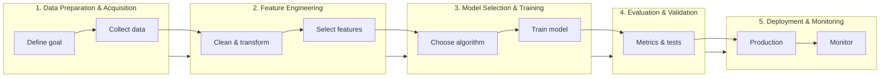

# Class 3 – Machine Learning Basics & Deep Learning Basics

This class builds directly on **Class 2 – Machine Learning Basics**. In Class 2 you prepared data for modeling (DataFrames, missing values, categorical encoding, scaling, and train/test splits). Class 3 assumes you are comfortable with those ideas and focuses on **training and evaluating models**, including a first look at **deep learning**.

## How this extends Class 2

Real-world ML follows a clear path. Class 2 covered data preparation and feature engineering. Class 3 moves into **model selection, training, and evaluation** using the same preprocessing pipeline.

| Step | What it means | Notebook(s) in this class |
|------|----------------|---------------------------|
| **1. Data Preparation & Acquisition** | Define the goal and collect high-quality data. | Small-dataset examples in all notebooks. |
| **2. Feature Engineering** | Clean, transform, and select the most relevant features for the model. | Assumes Class 2 preprocessing; notebooks show quick data setup. |
| **3. Model Selection & Training** | Choose an algorithm and train on prepared data. | **All notebooks** — Linear Regression, Logistic Regression, KNN, Decision Tree, Random Forest. |
| **4. Evaluation & Validation** | Test the model with appropriate metrics. | **All notebooks** — MSE, R², accuracy, confusion matrix, classification reports. |
| **5. Deployment & Monitoring** | Put the model in production and monitor it. | Later classes. |

**Start here:** Begin with **`01_class_3_linear_regression_basics.ipynb`** (regression: house size → price). Then **`02_class_3_logistic_regression_basics.ipynb`** (classification: study hours → pass/fail). Each notebook follows the same **10-step supervised learning pattern** and includes an **Open in Colab** button for browser-based runs.

---

## Slides

- **[Linear Regression Demo — PDF](Linear_Regression_demo1.pdf)** — Linear regression walkthrough slides.
- **[Logistic Regression Demo — PDF](Logistic_Regression_demo1.pdf)** — Logistic regression classification slides.
- **[Decision Tree Demo — PDF](Decision_Tree_demo.pdf)** — Decision tree classifier slides.
- **[Random Forest Demo — PDF](Random_Forest_demo.pdf)** — Random forest ensemble slides.
- **[KNN — PDF](KNN.pdf)** — K-Nearest Neighbors classifier slides.
- **[Supervised Learning Algorithms — PDF](Supervised%20Learning%20Algorithms.pdf)** — Overview and common step structure.

---

## Notebooks

| Notebook | What it covers |
|----------|----------------|
| **01_class_3_linear_regression_basics.ipynb** | Complete Linear Regression walkthrough (house size → price). Includes single-feature and multi-feature examples. *Start here.* |
| **02_class_3_logistic_regression_basics.ipynb** | Logistic Regression classification (study hours → pass/fail). Binary classification with accuracy, confusion matrix, and probability interpretation. |
| **03_class_3_multi_linear_regression.ipynb** | Multiple features (`Area`, `Bedroom`, `Age`) → `Price` using `LinearRegression`. Reinforces multi-feature regression concepts. |
| **04_class_3_knn_classifier.ipynb** | K-Nearest Neighbors classifier (`KNeighborsClassifier`) using `Age` + `Salary` → `Buy`. Focuses on distance-based classification and `n_neighbors` parameter. |
| **05_class_3_decision_tree_classifier.ipynb** | Decision Tree classifier (`DecisionTreeClassifier`) on `Age`/`Salary` → `Buy`. Highlights interpretability (tree structure) and overfitting risks. |
| **06_class_3_random_forest_classifier.ipynb** | Random Forest classifier (`RandomForestClassifier`) ensemble on `Age`/`Salary` → `Buy`. Introduces feature importance and compares against single-tree performance. |

Each notebook follows the same **10-step supervised learning pattern**:
1. Define the objective
2. Install/import libraries
3. Load or create a dataset
4. Separate features and target
5. Train/test split
6. Create the model
7. Train the model
8. Make predictions
9. Evaluate the model
10. (Optional) Visualize and interpret

All notebooks include an **Open in Colab** button in the intro for no-install runs in the browser.
