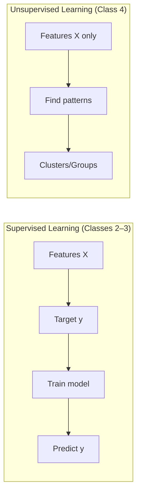

# Class 4 – Unsupervised Learning

This class introduces **unsupervised learning** algorithms, starting with **K-Means clustering**. Unlike supervised learning (Classes 2–3), unsupervised learning works with data that has **no labels**—you're finding hidden patterns, grouping similar data points, or reducing dimensionality.

## How this extends previous classes

Classes 2–3 focused on **supervised learning**: you had features (`X`) and targets (`y`), split into train/test sets, trained models, and evaluated predictions. Class 4 explores **unsupervised learning** where there are no labels—just data patterns to discover.

| Learning Type | What you have | What you find | Example |
|---------------|---------------|---------------|---------|
| **Supervised** | Features + labels | Predict labels for new data | House size → price, study hours → pass/fail |
| **Unsupervised** | Features only | Hidden patterns, groups, structure | Customer segments, document topics, image compression |

**Start here:** Begin with **`01_class_4_kmeans_basics.ipynb`** (K-Means clustering for customer segmentation). The notebook follows a clear step-by-step workflow and includes an **Open in Colab** button for browser-based runs.

---

## Slides

- **[K-Means Demo — PDF](unsupervised_kmeans_demo.pdf)** — Complete K-Means clustering walkthrough with customer segmentation example (Annual Income + Spending Score → clusters).

---

## Notebooks

| Notebook | What it covers |
|----------|----------------|
| **01_class_4_kmeans_basics.ipynb** | Complete K-Means clustering walkthrough. Customer segmentation example (Income + Spending Score → clusters). Includes step-by-step workflow, visualization, and experimentation with different numbers of clusters. *Start here.* |

The notebook follows a clear, beginner-friendly structure:
1. Define the objective
2. Install/import libraries
3. Load or create a dataset
4. Visualize the data
5. Apply K-Means clustering
6. Interpret clusters
7. (Optional) Experiment with different `n_clusters` values

The notebook includes an **Open in Colab** button in the intro for no-install runs in the browser.
## Future Updates

This folder will expand to include additional unsupervised learning algorithms:
- Hierarchical clustering
- DBSCAN clustering
- Dimensionality reduction (PCA, t-SNE)
- All following the same clear, step-by-step pattern
