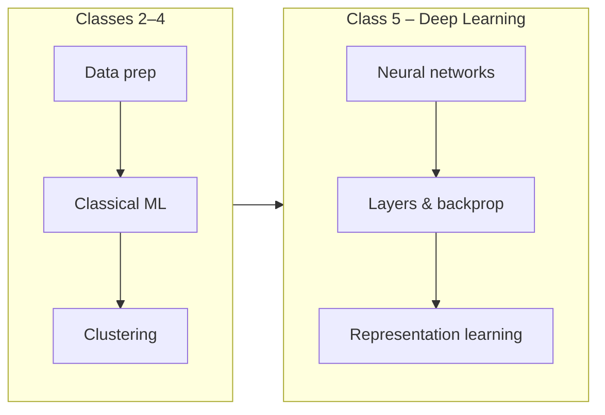

# Class 5 – Deep Learning

This class introduces **deep learning**: neural networks, how they learn, and how they build on the ML foundations from earlier classes. You'll see the shift from classical ML (feature engineering + shallow models) to learned representations and multi-layer networks.

## How this fits the course

Classes 2–4 covered **data prep**, **supervised learning** (regression, classification), and **unsupervised learning** (clustering). Class 5 focuses on **deep learning**—models with many layers that learn hierarchical representations from data, used in vision, NLP, and beyond.



| Topic | What you get |
|-------|----------------|
| **Lesson 1** | Introduction to deep learning and neural network basics. |
| **Lesson 2** | Deeper concepts: architectures, training, and representation learning. |
| **Lesson 3** | Advanced topics and practical considerations. |
| **Demo** | Hands-on deep learning demo (Deep_Learning_Demo2). |
| **House Price Demo** | Complete walkthrough: neural network for house price prediction (Deep_Learning_House_Price_Demo3). |

**Start here:** Work through **Lesson1.pdf**, then **Lesson2.pdf** and **Lesson3.pdf**. Use **Deep_Learning_Demo2.pdf** or **Deep_Learning_House_Price_Demo3.pdf** for concrete walkthroughs.

---

## Slides & materials

| File | Description |
|------|-------------|
| **[Lesson1.pdf](Lesson1.pdf)** | Deep learning introduction and neural network basics. |
| **[Lesson2.pdf](Lesson2.pdf)** | Architectures, training, and representation learning. |
| **[Lesson3.pdf](Lesson3.pdf)** | Advanced topics and practical considerations. |
| **[Deep_Learning_Demo2.pdf](Deep_Learning_Demo2.pdf)** | Hands-on deep learning demo. |
| **[Deep_Learning_House_Price_Demo3.pdf](Deep_Learning_House_Price_Demo3.pdf)** | Complete walkthrough: neural network for house price prediction. |

---

## Notebooks

| Notebook | What it covers |
|----------|----------------|
| **01_class_5_house_price_prediction.ipynb** | Complete neural network walkthrough for house price prediction. Builds a simple feedforward network (input → hidden layer → output) to predict house prices from size. Includes step-by-step workflow: dataset creation, model architecture, compilation, training, and predictions. *Start here.* |

All notebooks follow a clear, beginner-friendly structure:
1. Define the objective
2. Install/import libraries
3. Create or load dataset
4. Build the model
5. Compile the model
6. Train the model
7. Make predictions
8. Visualize and interpret results

Each notebook includes an **Open in Colab** button in the intro for no-install runs in the browser.

---

## Run locally

From the repo root:

```bash
pip install -r requirements.txt
cd class-5-deep-learning
jupyter notebook  # or jupyter lab
```

See the [main README](../README.md) for full setup and course schedule.
