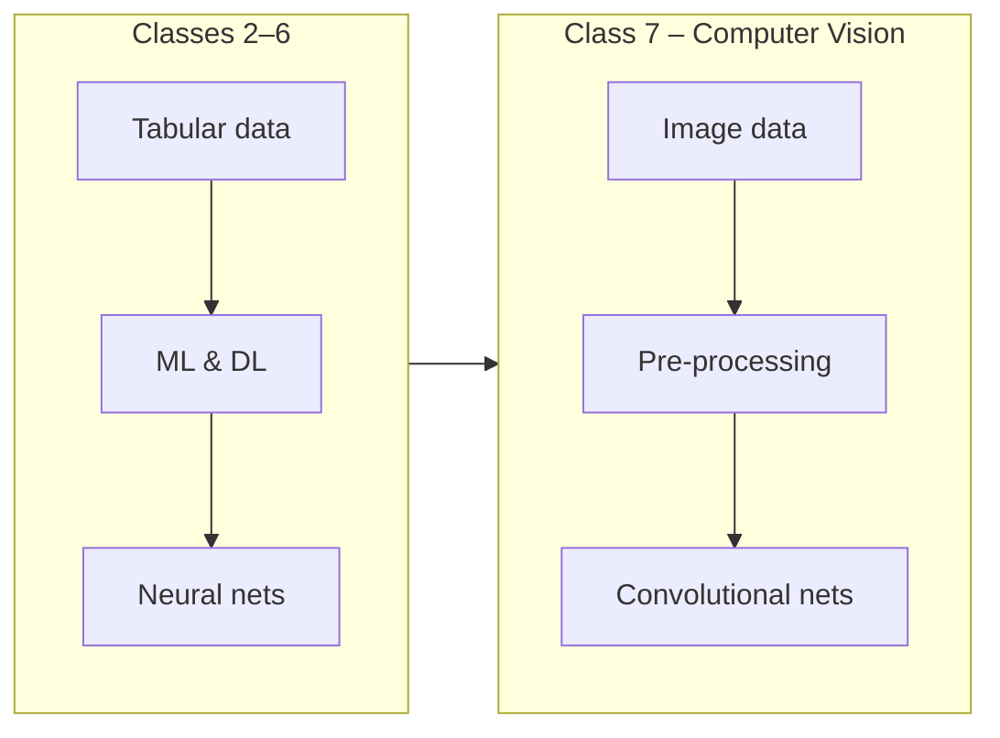

# Class 7 – Computer Vision (CV)

This class introduces **Computer Vision (CV)**: how we process, analyze, and understand images and video using algorithms and neural networks. We build on earlier classes by applying ML and deep learning ideas to visual data.

## How this fits the course

Classes 2–6 focused on **tabular data**, **clustering**, **deep learning**, and **NLP**. Class 7 (Computer Vision) extends these ideas to **images**:

- Loading and visualizing image data
- Pre-processing images (resizing, normalization)
- Using neural networks for image classification
- Concepts: convolutional layers, feature maps, transfer learning



| Topic | What you get |
|-------|----------------|
| **CV overview** | What computer vision is: image classification, object detection, segmentation. |
| **Image basics** | Loading images, representing pixels as arrays, simple transforms. |
| **Neural nets for images** | Convolutional layers, CNNs, and transfer learning (conceptual). |
| **Hands-on** | Stub notebook ready for image classification demos. |

**Start here:** Use `01_class_7_computer_vision_basics.ipynb` as your entry point. Content will be expanded as materials are added.

---

## Notebooks

| Notebook | What it covers |
|----------|----------------|
| **01_class_7_computer_vision_basics.ipynb** | Stub notebook: env check, placeholder for image loading and basic CNN classification. *Start here.* |

All notebooks follow a clear, beginner-friendly structure:
1. Define the objective
2. Install/import libraries
3. Load or create image data
4. Pre-process images
5. Build or use a model (e.g., CNN)
6. Train and evaluate
7. Interpret results

Each notebook includes an **Open in Colab** button in the intro for no-install runs in the browser.

---

## Run locally

From the repo root:

```bash
pip install -r requirements.txt
cd class-7-computer-vision
jupyter notebook  # or jupyter lab
```

For full computer vision demos (CNNs, transfer learning), you may need `tensorflow` or `torch` and `Pillow`—see notebook cells for install commands.

See the [main README](../README.md) for full setup and course schedule.
